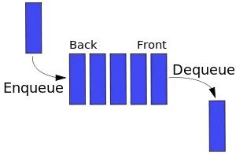

###### [Home][домой]/queue

# Очередь (Queue)



Очередь напоминает стек. Разница состоит в том, что очередь следует принципу FIFO (First In First Out — первым вошел, первым вышел). Когда вы стоите в очереди, первый в ней всегда будет первым.

Очередь имеет следующие методы:
- enqueue: войти в очередь, добавить элемент в конец
- dequeue: покинуть очередь, удалить первый элемент и вернуть его
- front: получить первый элемент
- isEmpty: проверить, пуста ли очередь
- size: получить количество элементов в очереди

Массив в JS имеет некоторые атрибуты очереди, поэтому мы можем использовать его для демонстрации:

```javascript
function Queue() {
    let collection = []

    this.print = function() {
        console.log(collection)
    }

    this.enqueue = function(element) {
        collection.push(element)
    }

    this.dequeue = function() {
        return collection.shift()
    }

    this.front = function() {
        return collection[0]
    }

    this.isEmpty = function() {
        return collection.length === 0
    }

    this.size = function() {
        return collection.length
    }
}
```
[Открыть файл кода][open]

[open]: ./Queue.js 'Открыть файл javascript'
[домой]: ../../README.md 'Вернуться на начальную страницу'