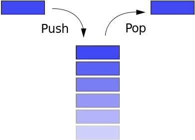

###### [Home][домой]/stack

# <span style='color: #47f5ff;'>Стек вызовов (Stack)


Стек следует принципу LIFO (Last In First Out — последним вошел, первым вышел). Если вы сложили книги друг на друга, и захотели взять самую нижнюю книгу, то сначала возьмете верхнюю, затем следующую и т.д. Кнопка «Назад» в браузере позволяет перейти (вернуться) на предыдущую страницу.

Стек имеет следующие методы:

- push: добавить новый элемент
- pop: удалить верхний элемент, вернуть его
- peek: вернуть верхний элемент
- length: вернуть количество элементов в стеке

Массив в JS имеет атрибуты стека, но мы построим его с нуля с помощью function Stack():

```javascript
function Stack() {
    this.count = 0
    this.storage = {}

    this.push = function(value) {
        this.storage[this.count] = value
        this.count++
    }

    this.pop = function() {
        if (this.count === 0) return undefined
        this.count--
        let result = this.storage[this.count]
        delete this.storage[this.count]
        return result
    }

    this.peek = function() {
        return this.storage[this.count - 1]
    }

    this.size = function() {
        return this.count
    }
}
```
[Открыть файл кода][open]


[open]: ./Stack.js 'Открыть js файл'
[домой]: ../../README.md 'Вернуться на начальную страницу'