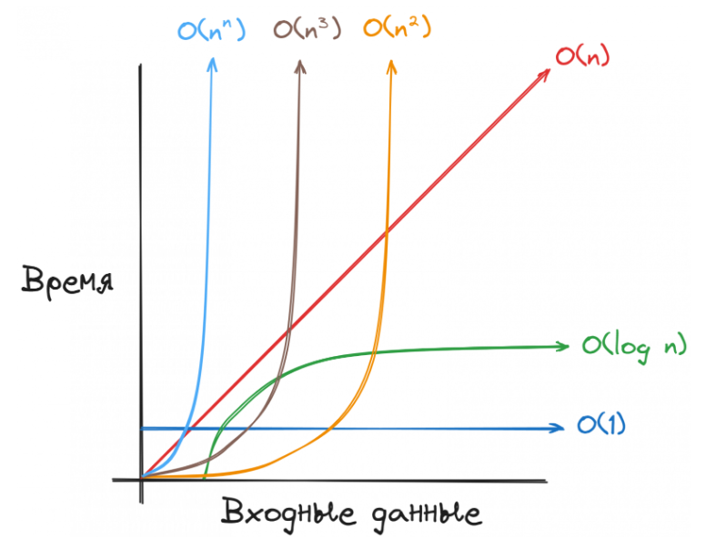

###### [Home][домой]/BigO

# <span style='color: #47f5ff;'> Нотация Big O

### Что такое алгоритмы?
Для начала давай разберёмся с базовыми определениями.

__Алгоритм__ — набор инструкций описывающий порядок действий для достижения определённых целей или решения конкретных задач.

Из этого определения можно подметить такой факт, что любой код, который решает какую-либо задачу, может считаться алгоритмом.

__Структура данных__ — способ организации и хранения данных, устроенный максимально эффективным способом.

Алгоритмы и структуры данных неотделимы друг от друга, так как структуры данных — содержат информацию, а алгоритмы — это инструкции по работе с этой информацией.

### Пара слов о нотации Big O

Для измерения эффективности необходимо позвать на помощь арбитра, который сможет максимально критично оценить производительность алгоритма.

__Big O__ — нотация, которая позволяет определить верхнюю границу скорости работы алгоритма. Асимптотическая сложность, которая описывает верхнюю границу сложности алгоритма при увеличении размера входных данных, или то, как рост размера входных данных влияет на количество операций.


Чтобы было понятнее, рассмотрим на примере:

Обычный обход по массиву имеет сложность O(n), где n — количество элементов массива. Если внутри этого цикла добавить ещё один, который также будет проходить по всем элементам массива, то сложность внешнего цикла возрастёт до O(n2).

В Big O константы откидываются, представим ситуацию, что у нас существует функция, в которой существуют 2 одинаковых цикла.

### Алгоритмы сортировки
Переходим к разговору об алгоритмах сортировки. В этом разделе вы узнаете про такие алгоритмы, как:

- Сортировка пузырьком;

- Сортировка выбором;

- Циклическая сортировка;

- Быстрая сортировка;

Рассмотрим, чем они отличаются друг от друга, для чего применяются и где используются. Также мы рассмотрим на их имплементацию и визуализацию, и разберёмся, как реализовать их шаг за шагом.

Перед тем, как перейдём к изучению алгоритмов сортировки, надо уточнить, что алгоритмы сортировки подразделяют на стабильные и нестабильные.

Алгоритм является стабильным только в том случае, если он не меняет порядок элементов с одинаковыми значениями относительно друг друга. Соответственно, нестабильный алгоритм — наоборот.

При сортировки списка чисел на этот параметр можно не обращать внимания, а если мы собираемся сортировать массив/объект данных, то этот показатель может сыграть злую шутку.

Например, существует такой список:

```javascript
const users = [
	{ number: 4, name: "Николай" },
	{ number: 2, name: "Анастасия" },
	{ number: 1, name: "Тимур" },
	{ number: 2, name: "Евгений" },
	{ number: 3, name: "Катерина" }
]
```
После сортировки стабильным алгоритмом этот список будет выглядеть следующим образом:
```javascript
const users = [
	{ number: 1, name: "Тимур" },
	{ number: 2, name: "Анастасия" },
	{ number: 2, name: "Евгений" },
	{ number: 3, name: "Катерина" }
	{ number: 4, name: "Николай" }
]
```
Пользователь «Анастасия» гарантированно будет находиться выше пользователя «Евгений», так как это было в исходном массиве. Нестабильный алгоритм гарантировать это не может.

### Сортировка пузырьком
Сортировка пузырьком — самый примитивный и базовый алгоритм сортировки. Он является основой для некоторых других алгоритмов. Этот алгоритм является стабильным. Сортировка пузырьком перебирает весь массив элементов, сравнивая два соседних элемента друг с другом и меняя их местами в соответствии с условиями. Элементы с большим значением опускаются вниз массива, а элементы с наименьшим значением поднимаются вверх, подобно пузырькам газа.

Сложность алгоритма: O(n2), где n — количество элементов массива. Так как мы запускаем вложенный цикл, сложность алгоритма равна O(n2)

_Шаги реализации:_

- Запускаем цикл i по массиву.

- Запускаем внутренний цикл j, который идёт от 0 до arr.length - i. Это ускоряет алгоритм, так как он не проходит по уже отсортированным элементам.

- Во внутреннем цикле проверяем соседние элементы и меняем их местами, если сосед слева больше соседа справа.

_Пример кода:_
```javaScript
const bubbleSort = (arr) => {
  for (let i = 0; i < arr.length; i++) {
    for (let j = 0; j < arr.length - i; j++) {
      if (arr[j] > arr[j + 1]) {
        [arr[j], arr[j + 1]] = [arr[j + 1], arr[j]]; // Меняем значения переменных
      }
    }
  }
};
```
_Алгоритм следует использовать в следующем случае:_

- Когда количество входных данных невелико, так как его временная сложность составляет O(n2).


[домой]: ../../README.md 'Вернуться на начальную страницу'
